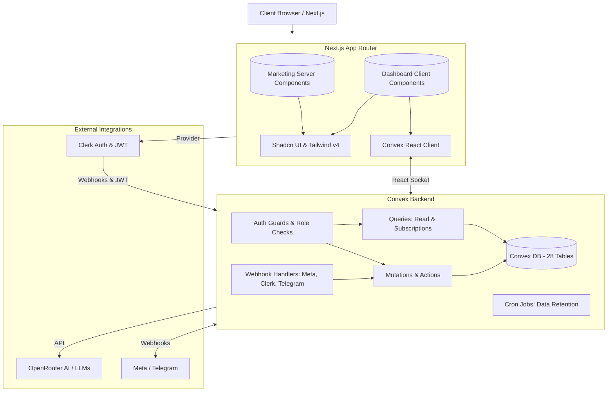

# Codebase Analysis Summary

## 1. Executive Summary

The Yoosr project is a modern, modular SaaS application built with Next.js 16 (App Router), React 19, Tailwind CSS v4, and Shadcn UI on the frontend, with Convex as the reactive real-time backend and Clerk for authentication. The architecture heavily embraces Server/Client Component isolation and utilizes AI integrations (OpenRouter) for dynamic workflow generation. While the project exhibits strong foundational choices like proper schema structuring, multi-tenant partitioning, and robust UI/UX frameworks, there are critical gaps in human-readable documentation, schema validations (overuse of `v.any()`), and certain authorization boundaries. It is well-optimized for AI agent interactions, but human developer onboarding requires substantial improvement.

## 2. Architecture Diagram

## 3. Key Findings

*   **01-Package Dependencies**: Relies cleanly on Bun, Next.js 16, React 19, and Convex. Contains minor devDependency misplacements (e.g., `@types/papaparse` in runtime) and unused plugins requiring cleanup to reduce bundle overhead.
*   **02-Build Tooling & Config**: Configured optimally with Turbopack and Tailwind v4 CSS-first theming. Lacks build-time environment variable validation and uses weakened Content Security Policy settings (`unsafe-eval`).
*   **03-Project Structure & Git**: Utilizes a clean, hybrid monorepo-style structure dividing `src/`, `convex/`, and `messages/`. Employs strong CI/CD branching logic, though documentation relies heavily on hidden `.agent` folders.
*   **04-Database Schema**: Boasts 28 tables featuring scalable multi-tenant index optimization and vector search integration. Marred by over-reliance on `v.any()`, lack of TTL on core messaging tables, and inconsistent metadata timestamps.
*   **05-Queries (Read Operations)**: Consistently implements index scanning and resilient "soft-returns" (null/[]) for unauthorized views. Advanced dashboard aggregations may face scalability risks due to heavy in-memory table parsing bounds.
*   **06-Mutations (Write Operations)**: Executed alongside exhaustive event-driven logging and cascading wipe structures. Public endpoints safely abstract OCC collisions, but state mappings across certain endpoints overlap densely.
*   **07-Auth & Authorization**: Centralized authorization via Clerk JWTs and localized `admin` vs `member` access wrappers. Major oversight where several conversation actions circumvent project/organization ownership checks.
*   **08-Backend Utilities**: Houses abstract integrations handling encryption, LLM rate-limiting, and signature verification seamlessly. Highly resilient orchestration handling external retries effectively without leaking tokens.
*   **10-Layout & Structural Components**: Operates deeply nested routing balancing Right-To-Left translation context inherently against auth states. Contains reliable React Suspense bounds via customizable layout components natively.
*   **11-Design Tokens & Styling**: Fully adopts Tailwind CSS v4's standard dynamic setup via `@theme` inline attributes directly. Lacking standalone design system repositories documenting specific localized styling variables (`--lp-*`).
*   **13-Page Components & Views**: Divides interface logic sharply allocating SEO-heavy views to Server Components. Employs strong, segmented error isolation (`error.tsx`/`loading.tsx`) natively across app folders dynamically.
*   **14-State Management & Fetching**: Uniquely dependent almost strictly on Convex's automatic reactivity rather than typical store management systems (e.g. Zustand/Redux). Encounters severe form redundancies heavily using vanilla `useState` repetitively.
*   **15-Feature Modules**: Connects internal feature sets tightly through activity logging integrations systematically. Showcases a high-level approach mapping conversational rules directly out of generalized AI prompts into JSON structures contextually.
*   **18-Documentation & DX**: Developer experience is intensely tailored for AI consumption instead of human iteration. Omits baseline project instructions, root documentation mapping, and fundamental contribution guides.

## 4. Strengths

*   **Modern Foundational Stack**: Fully leverages Next.js 16 server/client separation with Turbopack parsing alongside Tailwind CSS v4.
*   **Robust Internationalization (i18n)**: Employs deep configuration enforcing Right-To-Left UI compatibility organically matching locale selections.
*   **Advanced AI Pipelines**: Phenomenal integration utilizing LLMs to synthesize and dictate logical React Flow graph generation natively.
*   **Secure Webhook Architecture**: Exceptionally well-organized ingestion processing preventing exploits utilizing strict Svix, Telegram, and Meta HMAC signature validation models.
*   **Multi-tenant Scaling**: Built-in multi-tenant isolation utilizing Clerk Organization IDs paired optimally with Convex's indexed project references dynamically.

## 5. Risks & Concerns

**HIGH Severity:**
*   **Data Authorization Gaps**: Multiple conversation mutations (`join`, `resolve`, `updateVisitorInfo`) and `conversations.get` lack logic verifying the user's specific Organization matches the underlying parent Project.
*   **Unauthenticated Writes**: `conversations.create` bypasses user authentication checks natively permitting uncontrolled endpoint invocation contexts. 
*   **Boundless Table Scaling**: The highest-volume tables (`conversations`, `messages`) feature absolutely zero scheduled TTL cleanup configurations pointing toward explosive long-term operational scaling costs.
*   **Destructive Data Architecture**: Hard database deletes are applied uniformly leaving no operational recovery opportunities and presenting heightened risks of cascading referential disconnects.
*   **Plaintext Secret Leaks**: Active embedding of the `openRouterApiKey` inside `projects` tables explicitly omitting critical database encryption wrappers.
*   **Absent Onboarding Setup**: The complete absence of standard human documentation architectures (lack of root `README.md` and basic bootstrapping commands).

**MEDIUM Severity:**
*   **Weakened CSP Policy**: Security postures lowered utilizing explicit `'unsafe-inline'` and `'unsafe-eval'` script boundaries.
*   **Unsafe Schema Declarations**: Schema definitions randomly adopt `v.any()` (e.g. for nodes/attachments), totally disabling database evaluation assurances.
*   **Runtime Environment Fragility**: Unvalidated environment configurations risk triggering hidden runtime faults omitting build-time deployment verification completely.
*   **Scattered Artificial Form Load**: Extreme repetitive reliance on inline React state hooks bounding inputs limits systematic UI component abstraction scaling logically.

## 6. Recommendations

*   **Immediate Auth Patching**: Add rigorous `assertProjectOwnership()` guards to explicitly enforce organization isolation surrounding every conversation endpoint instantly.
*   **Consolidated Form Abstraction**: Establish a unified form dependency architecture employing `react-hook-form` coupled closely to `Zod` validation mitigating massive local `useState` boilerplate code.
*   **Soften Data Removal Strategy**: Revise database schemas instituting simple `deletedAt` metadata capturing properties avoiding hard-removal triggers immediately natively.
*   **Scheduled Pruning Mechanisms**: Institutionalize formal TTL auto-dropping constraints executing asynchronously to protect unbound log table cost inflation automatically.
*   **Safe Dependency Bootstrapping**: Elevate environmental secrets against schema models utilizing strictly verified boundary parsing structures extending like `@t3-oss/env-nextjs`.

## 7. Technical Debt

*   Over 120 disorganized vanilla `useState` hooks bound to uncontrolled native configurations replacing functional robust centralized library forms.
*   Highly unstandardized structural schema definitions parsing specific timestamp behaviors (`createdAt` alongside omitted `updatedAt`).
*   Independent, unchecked implicit mapping between Clerk identities referencing decoupled Convex items lacking hard referential verification locks.
*   Lingering deprecated, duplicate bot state attributes arbitrarily persisting mutually across localized conversation spaces alongside separated table environments. 

## 8. Security Audit

*   **Data Ownership Risk**: Read constraints like `conversations.get` bypass organization isolation restrictions allowing potential arbitrary parameter scraping.
*   **Data Ownership Risk**: `conversations.create` completely omits mandatory identifier parsing rules globally.
*   **Data Integrity Risk**: Application-specific private API parameters, notably the `openRouterApiKey`, are committed transparently to generic tables explicitly inside `projects`. 
*   **Script Evaluation Risk**: Relaxations mapped actively within global application load policies enabling explicit XSS attack surfaces directly over inline script payloads.

## 9. Dependency Health

*   Structural configuration failures persist positioning type abstractions like `@types/papaparse` poorly into standard production dependencies.
*   Stale component dependencies including `tailwindcss-animate` and `@huggingface/inference` reside globally inactive taking up lockfile bandwidth pointlessly.
*   Enormous data visualizer packages like `recharts` alongside heavy computational modules (`@xyflow/react` and `xlsx`) substantially damage chunk footprints urgently requiring code splitting through delayed React loading optimization.

## 10. Next Steps

1.  **High Priority**: Implement explicit ownership filters strictly enforcing `assertProjectOwnership()` on cross-database conversational access protocols natively mapped through `convex/conversations.ts`.
2.  **High Priority**: Construct core developer operational guides immediately outlining setup contexts integrating standard `README.md` and `CONTRIBUTING.md`.
3.  **High Priority**: Transition `openRouterApiKey` handling actively through local `crypto.ts` methodologies abstracting raw string persistence immediately internally.
4.  **Medium Priority**: Begin systematic reduction of internal component states utilizing strict contextual mapping tools specifically bridging local inputs toward `Zod` references smoothly. 
5.  **Medium Priority**: Convert core operational wipe functions seamlessly toward explicit `deletedAt` metadata constraints enabling recoverable action flows automatically.
