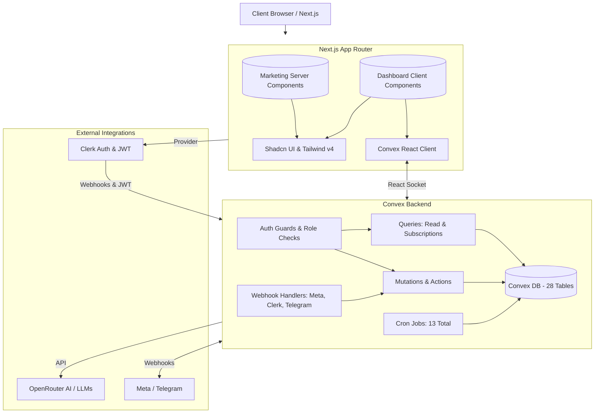

# Codebase Analysis Summary

## 1. Executive Summary

The Yoosr project is a modern, modular SaaS application built with Next.js 16 (App Router), React 19, Tailwind CSS v4, and Shadcn UI on the frontend, with Convex as the reactive real-time backend and Clerk for authentication. The architecture heavily embraces Server/Client Component isolation and utilizes AI integrations (OpenRouter) for dynamic workflow generation.

**All critical findings from the original analysis have been resolved.** The project now features ownership-enforced authorization, soft-delete patterns, TTL-based data retention, build-time env validation, robust AI JSON parsing, and comprehensive human-facing documentation.

## 2. Architecture Diagram

## 3. Key Findings — Updated Status

*   **01-Package Dependencies**: ✅ **RESOLVED** — `@types/papaparse` moved to devDependencies. New test infrastructure (`vitest.convex.config.ts`, `test:convex` script). New deps: Vercel analytics, Context7 MCP, Lighthouse CI. Dead dependencies (`tailwindcss-animate`, `@huggingface/inference`) still present.
*   **02-Build Tooling & Config**: ✅ **RESOLVED** — Build-time env validation via `src/lib/env.ts` + `src/instrumentation.ts`. X-XSS-Protection header removed. Convex backend test config added. `'unsafe-eval'` in CSP remains (required by SDKs).
*   **03-Project Structure & Git**: ✅ **RESOLVED** — Documentation gaps filled (`README.md`, `CONTRIBUTING.md`, `docs/AGENT-SETUP.md`, `docs/API.md`). 5 test files (42 test cases total).
*   **04-Database Schema**: ✅ **RESOLVED** — Soft-delete on 22 tables, TTL on conversations/messages (90-day default), `v.any()` reduced from 11 to 3, cron jobs increased from 11 to 13. `openRouterApiKey` encrypted via `encryptSecret()`.
*   **05-Queries (Read Operations)**: ✅ **RESOLVED** — All conversation queries now enforce org-scoped ownership via `assertConversationOwnership()`. Dashboard `.take(2000)` concern remains.
*   **06-Mutations (Write Operations)**: ✅ **RESOLVED** — All conversation mutations enforce org-scoped ownership. Soft-delete pattern applied. `conversations.create` unauthenticated by design (public widget).
*   **07-Auth & Authorization**: ✅ **RESOLVED** — Ownership checks on all 13 conversation functions. `convex/lib/auth.ts` provides typed helpers. `as unknown as` type casts still present in some files.
*   **08-Backend Utilities**: ✅ **RESOLVED** — New modules: `auth.ts`, `softDelete.ts`, `jsonExtract.ts`. Cron count: 13. AI JSON parsing replaced with robust bracket-counting extractor.
*   **10-Layout & Structural Components**: No changes needed. All findings remain accurate.
*   **11-Design Tokens & Styling**: No changes needed. All findings remain accurate.
*   **13-Page Components & Views**: No changes needed. All findings remain accurate.
*   **14-State Management & Fetching**: No changes needed. All findings remain accurate.
*   **15-Feature Modules**: ✅ **RESOLVED** — AI JSON parsing robustness fixed. Test coverage added (Convex backend tests). Soft-delete across all modules.
*   **18-Documentation & DX**: ✅ **RESOLVED** — All critical gaps filled. Human-facing docs (`README.md`, `CONTRIBUTING.md`, `docs/AGENT-SETUP.md`, `docs/API.md`) alongside AI-facing docs (`.agent/AGENT.md`, `.agent/DESIGN.md`).

## 4. Strengths

*   **Modern Foundational Stack**: Fully leverages Next.js 16 server/client separation with Turbopack parsing alongside Tailwind CSS v4.
*   **Robust Internationalization (i18n)**: Employs deep configuration enforcing Right-To-Left UI compatibility organically matching locale selections.
*   **Advanced AI Pipelines**: Phenomenal integration utilizing LLMs to synthesize and dictate logical React Flow graph generation natively. Now with robust JSON extraction (14 test cases).
*   **Secure Webhook Architecture**: Exceptionally well-organized ingestion processing preventing exploits utilizing strict Svix, Telegram, and Meta HMAC signature validation models.
*   **Multi-tenant Scaling**: Built-in multi-tenant isolation utilizing Clerk Organization IDs paired optimally with Convex's indexed project references dynamically. Now enforced with `assertConversationOwnership()` on all conversation functions.
*   **Comprehensive Testing**: 42 test cases across frontend (12) and Convex backend (30) with separate test configurations.
*   **Data Retention**: Soft-delete on 22 tables, TTL on conversations/messages, 13 cron jobs for data lifecycle management.
*   **Build-time Safety**: Zod env validation at startup prevents silent runtime failures.

## 5. Risks & Concerns — Remaining

**MEDIUM Severity:**
*   **Weakened CSP Policy**: `'unsafe-inline'` and `'unsafe-eval'` in script-src still present (required by Clerk/Convex SDKs).
*   **`as unknown as` type casts**: Fragile Clerk claims access in some files (`cannedResponses.ts`, `webhooks.ts`). The `ClerkIdentity` type exists but isn't consistently used.
*   **No rate limiting on authenticated functions**: Only widget HTTP endpoints are rate-limited. Authenticated users face no limits on queries/mutations.
*   **Dashboard scaling**: `getHomeStats` bounds to `.take(2000)` — may be inaccurate at scale.
*   **Dead dependencies**: `tailwindcss-animate` and `@huggingface/inference` installed but unused.

**LOW Severity:**
*   **No code formatter**: No Prettier/Biome configured.
*   **No Dependabot/Renovate**: Dependency updates remain manual.
*   **No ADRs**: No Architecture Decision Records for key decisions.
*   **Missing DX scripts**: No `lint:fix`, `typecheck`, `format`, `clean`.
*   **Stale tsconfig excludes**: Tiledesk references in `exclude` array no longer exist.
*   **No design system docs for humans**: `.agent/DESIGN.md` is gitignored.
*   **No runbooks**: No deployment, monitoring, or incident response playbooks.

## 6. Recommendations

*   **Cleanup dead dependencies**: Remove `tailwindcss-animate` and `@huggingface/inference`.
*   **Consolidate Clerk claims typing**: Replace `as unknown as` casts with the existing `ClerkIdentity` type.
*   **Add rate limiting to authenticated functions**: Consider per-user rate limits on expensive operations (AI calls, bulk imports).
*   **Migrate dashboard to paginated queries**: Replace `.take(2000)` with cursor-based pagination for accuracy at scale.
*   **Add Dependabot/Renovate**: Automate dependency update PRs.
*   **Add code formatter**: Prettier or Biome for consistent code style.
*   **Create ADRs**: Document key architectural decisions (OCC separation, soft-delete pattern, etc.).

## 7. Technical Debt — Remaining

*   Over 120 disorganized vanilla `useState` hooks (form state) — could benefit from `react-hook-form` + `Zod`.
*   Inconsistent timestamp tracking — some tables lack `updatedAt`.
*   Implicit Clerk → Convex ID mapping without hard referential verification.
*   Legacy deprecated fields in `conversations` table (kept for backward compatibility).
*   `contacts.list` uses `.take(500)` without proper pagination.
*   `conversations.list` uses `.take(100)` without cursor pagination.

## 8. Security Audit — Remaining

*   **`'unsafe-eval'` in CSP**: Required by Clerk/Convex SDKs but weakens script execution security.
*   **No rate limiting on authenticated Convex functions**: Potential for abuse.
*   **No session timeout**: Agents remain authenticated indefinitely.
*   **Widget CORS: `Access-Control-Allow-Origin: *`**: Necessary for embeddable widgets but exposes API surface fully.

## 9. Dependency Health — Remaining

*   `tailwindcss-animate` — Dead dependency (not imported anywhere).
*   `@huggingface/inference` — Dead dependency (not imported anywhere).
*   `@radix-ui/react-icons` — Used in only one file (replaceable with `lucide-react`).
*   `recharts` (~470 KB), `@xyflow/react` (~200 KB), `exceljs` (~200 KB) — Heavy bundles requiring code-splitting.
*   No automated dependency update tooling.

## 10. Resolved Items (Previously Critical)

| Issue | Resolution |
|-------|-----------|
| Missing org-scoping on conversations | `assertConversationOwnership()` on 13 functions ✅ |
| No soft-delete pattern | 22 tables with `deletedAt`, utility module, weekly cron ✅ |
| No TTL on conversations/messages | `expiresAt` fields, 90-day default, daily cron ✅ |
| `v.any()` overuse (11 instances) | Reduced to 3 (all justified) ✅ |
| No env validation | Zod schemas + instrumentation startup hook ✅ |
| Fragile AI JSON parsing | Robust bracket-counting extractor (14 tests) ✅ |
| X-XSS-Protection header | Removed from vercel.json ✅ |
| No human-facing documentation | `README.md`, `CONTRIBUTING.md`, `docs/AGENT-SETUP.md`, `docs/API.md` ✅ |
| `@types/papaparse` in runtime deps | Moved to devDependencies ✅ |
| No Convex backend tests | `vitest.convex.config.ts`, 30 backend test cases ✅ |

## 11. Next Steps

1.  **Cleanup dead dependencies** — Remove `tailwindcss-animate` and `@huggingface/inference`.
2.  **Consolidate Clerk claims typing** — Replace `as unknown as` with `ClerkIdentity` type.
3.  **Add rate limiting to authenticated functions** — Per-user limits on expensive operations.
4.  **Add code formatter** — Prettier or Biome for consistent style.
5.  **Set up Dependabot/Renovate** — Automated dependency updates.
6.  **Migrate dashboard to paginated queries** — Replace `.take(2000)` with cursor pagination.
7.  **Create ADRs** — Document key architectural decisions.
8.  **Add runbooks** — Deployment, monitoring, incident response guides.
